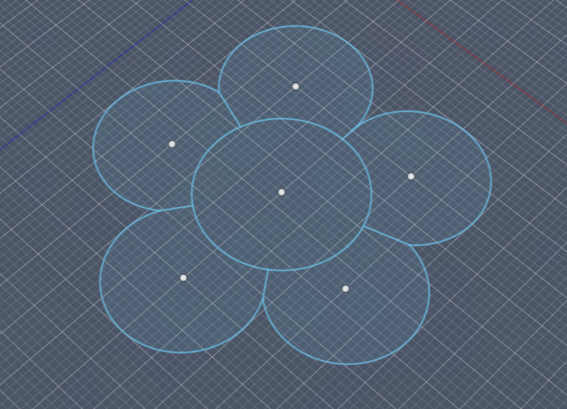

# Projeto individual Renata

![[WhatsApp Image 2026-06-10 at 21.44.59.jpeg)
Aplicação de diferentes tecnologias de produção digital para criar soluções simples, funcionais e personalizadas.

## Conceito 

Este projeto teve como objetivo explorar diferentes tecnologias de fabrico digital através da criação de dois objetos distintos: um organizador em forma de flor produzido por impressão 3D e um autocolante personalizado produzido através de corte de vinil.

Através destes dois objetos foi possível aplicar conhecimentos de modelação digital, preparação de ficheiros para fabrico e utilização de diferentes equipamentos de laboratório. O projeto demonstra como tecnologias distintas podem ser utilizadas para criar objetos funcionais e elementos visuais personalizados, respondendo a necessidades e finalidades diferentes.

## Tecnologias Usadas

Uma ou mais tecnologias estudadas em laboratório:

- [x] Corte 2D (laser / vinil)
- [x] Impressão 3D
- [ ] CNC
- [ ] Micro:bit / computação física
- [ ] Outras —

### Materiais  
  
- Filamento PLA  
- Vinil adesivo  
  
### Software  
  
- Fusion 360  
- Silhouette Studio

## Processo

O desenvolvimento do projeto passou por várias etapas de modelação, teste e produção. Ao longo do processo foram feitas algumas alterações para melhorar a forma e a funcionalidade da peça.

### Iteração 1 — [Organizador em formato de flor]

_**O que tentei:**_  Comecei por criar o modelo 3D no Fusion 360. O desenho foi construído a partir de um círculo central rodeado por cinco círculos de dimensões idênticas, criando uma composição semelhante a uma flor. Posteriormente, foi aplicada altura à peça através da ferramenta extrusão e criados os compartimentos internos.

![[attachments/attachments 1/attachments 2/Captura de ecrã 2026-06-10 201437.png]]
Após concluir a modelação, exportei o ficheiro em formato STL e preparei-o para impressão 3D. Foram definidos os parâmetros de impressão e verificada a estabilidade da peça antes do início do processo.
Esta etapa permitiu compreender melhor a relação entre o modelo digital e o objeto físico. Foi possível verificar se as espessuras das paredes eram adequadas e confirmar que o design funcionava corretamente quando produzido em escala real.

![[attachments/attachments 1/attachments 2/Captura de ecrã 2026-06-10 210632.png]]

_**O que aprendi:**_ Durante esta fase percebi a importância de definir corretamente as dimensões antes da impressão, uma vez que pequenas alterações no diâmetro dos compartimentos podem influenciar a funcionalidade do objeto. Aprendi também a utilizar padrões circulares para distribuir elementos de forma uniforme.

![[WhatsApp Image 2026-05-27 at 12.22.16 (3).jpeg|372]]
![[WhatsApp Video 2026-05-27 at 12.22.27.mp4]]

### Iteração 2 — [sticker de panda]

_**O que tentei:**_ Como segundo objeto do projeto, desenvolvi um autocolante em vinil a partir de um desenho criado no Illustrator. Após a conclusão do design, o ficheiro foi preparado no Silhouette Studio e produzido através de corte de vinil na Silhouette Cameo, permitindo explorar o processo de transformação de um elemento gráfico digital num objeto físico.

![[experiencias/INDIVIDUAIS/sara/Sara/attachments 1/attachments 1/sticker.jpeg]]
_**O que aprendi:**_ Aprendi a preparar ficheiros para corte de vinil e a ajustar os parâmetros necessários para obter um corte limpo e preciso. Esta etapa demonstrou como diferentes tecnologias podem ser combinadas para enriquecer um produto final.

![[attachments/attachments 1/attachments 2/ft.jpeg]]
## Resultado Final

O resultado final do projeto consiste em dois trabalhos desenvolvidos de forma independente, cada um explorando uma tecnologia de fabrico digital diferente.

O primeiro resultado foi um **organizador em forma de flor**, concebido através de modelação 3D no Fusion 360 e produzido por impressão 3D. A peça apresenta um compartimento central rodeado por cinco compartimentos laterais, permitindo organizar pequenos objetos de forma prática e acessível. A sua forma inspirada numa flor contribui para uma aparência simples e visualmente agradável, sem comprometer a funcionalidade.

O segundo resultado foi um **autocolante personalizado em vinil**, desenvolvido a partir de um desenho digital e posteriormente produzido com recurso à Silhouette Cameo. Este trabalho permitiu explorar o processo de preparação de ficheiros para corte e a produção de elementos gráficos físicos através do corte de vinil.

![[attachments/attachments 1/attachments 2/flor final 1.jpeg]]
![[stickerr 1.jpeg]]

## Reflexão

Este projeto permitiu-me aprofundar os conhecimentos adquiridos sobre fabrico digital, explorando duas tecnologias diferentes: a impressão 3D e o corte de vinil. Através da criação do organizador e do autocolante, tive a oportunidade de acompanhar todas as etapas do processo, desde a conceção da ideia até à produção final dos objetos.

A parte que mais gostei de desenvolver foi a modelação e impressão do organizador, pois permitiu transformar uma ideia simples num objeto físico e funcional. Foi interessante perceber como pequenas decisões durante a fase de desenho influenciam o resultado final após a impressão.

O desenvolvimento do autocolante também foi uma experiência importante, uma vez que me permitiu explorar a preparação de ficheiros para corte e compreender melhor o funcionamento da Silhouette Cameo. Apesar de ser um projeto mais simples, ajudou-me a adquirir competências úteis para futuros trabalhos gráficos.

Se tivesse mais tempo, gostaria de experimentar diferentes dimensões, formas e acabamentos para o organizador, de modo a explorar melhor as possibilidades da impressão 3D. Também seria interessante aprofundar a utilização do corte de vinil através da criação de designs mais complexos. No geral, considero que o projeto cumpriu os objetivos propostos e contribuiu para uma melhor compreensão das tecnologias de fabrico digital utilizadas em laboratório.
