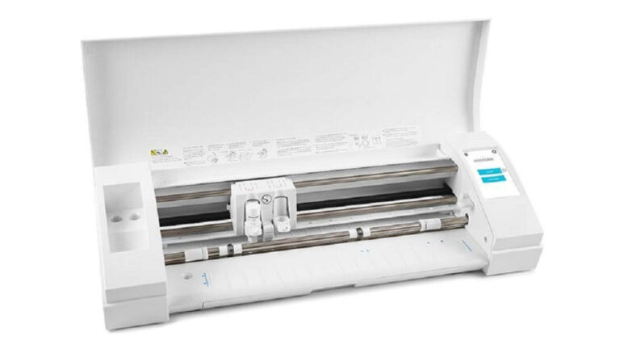

# Silhouette-Cameo

> A **Silhouette Cameo** é uma máquina que corta desenhos em materiais como papel, cartolina, vinil e autocolante, sendo usada para trabalhos criativos, decoração, maquetes e personalização de objetos.

Para a **Silhouette Cameo**, é importante criar desenhos simples, com linhas bem definidas, porque a máquina corta o material seguindo essas linhas. Devem evitar-se detalhes muito pequenos, linhas muito próximas e materiais demasiado grossos, pois podem rasgar ou não cortar corretamente.
## 1. Como desenhar para esta tecnologia?

Primeiro preparar o desenho ,o desenho pode ser criado diretamente no programa ou importado a partir de outro software de desenho, como Illustrator, Canva ou Fusion, desde que esteja exportado em dxt

## 2. Como preparar um ficheiro para a máquina

Depois de guardar o ficheiro ,.dxt , abrirmos o desenho no **Silhouette Studio**, deve-se ajustar o tamanho do objeto de acordo com as dimensões pretendidas. Nesta fase, é importante confirmar que o desenho está dentro da área de corte da base da Silhouette Cameo.
## 3. Antes de Começar

De seguida, coloca-se o material ,este sendo o vinil ,sobre a base de corte, garantindo que fica bem alinhado e aderente de seguida tranca os trincos e carrega  se o material. O material deve ficar direito e sem dobras, para evitar erros durante o corte. 

No software Silhouette Studio, deve-se selecionar o tipo de material que está a ser utilizado ,vinil fosco. Esta escolha define automaticamente alguns parâmetros, como a força de corte, a velocidade e a profundidade da lâmina. Se necessário, estes valores podem ser ajustados manualmente.

Depois de confirmar as definições, a base de corte deve ser inserida na **Silhouette Cameo**, alinhando-a com as guias da máquina. Em seguida, carrega-se no botão de carregamento para que a máquina puxe a base para a posição correta.

Com tudo preparado, envia-se o ficheiro para corte através do **Silhouette Studio**. Durante o processo, é importante acompanhar o funcionamento da máquina, garantindo que o material não se desloca e que o corte decorre corretamente.

No final, descarrega-se a base da máquina e retira-se cuidadosamente o material cortado. 

